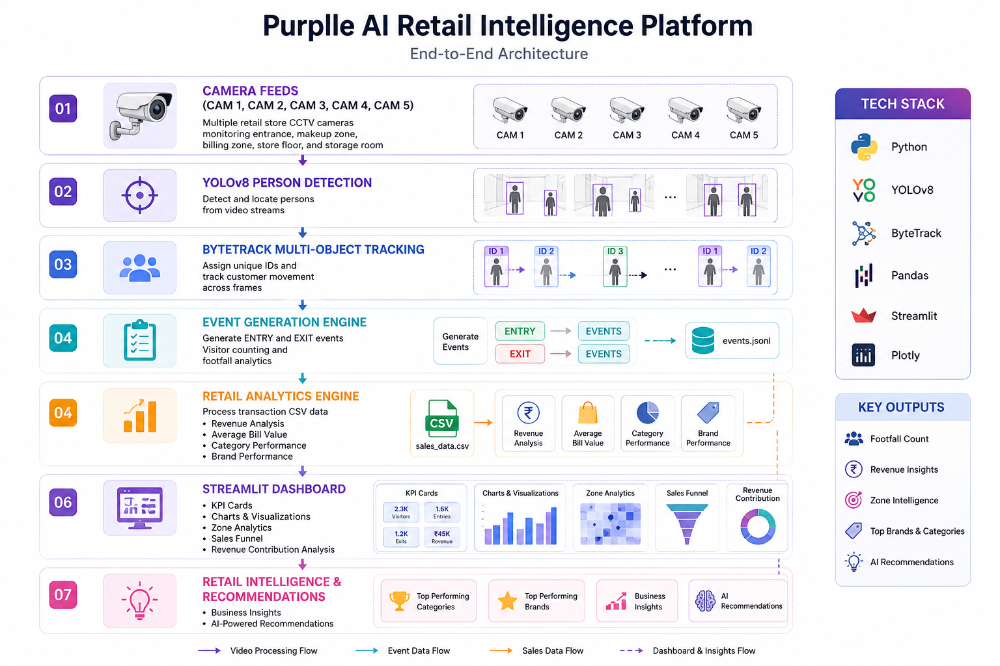

# Purplle Store Intelligence

## Problem Statement
Retail stores lack visibility into customer movement, zone performance, and sales conversion.

## Solution
An AI-powered retail intelligence platform combining computer vision and sales analytics.

## Features
- Multi-camera monitoring
- Footfall analytics
- Zone analytics
- Sales analytics
- Brand performance tracking
- Category performance tracking
- Conversion rate monitoring
- AI recommendations

## Camera Mapping
CAM 1 → Store Floor
CAM 2 → Makeup Zone
CAM 3 → Entrance
CAM 4 → Storage Room
CAM 5 → Billing Zone

## Business Insights
- Makeup contributes ~64% of revenue
- Faces Canada is the top-performing brand
- Average Bill Value ≈ ₹1430

## Tech Stack
- Python
- YOLOv8
- ByteTrack
- Streamlit
- Pandas
- Plotly

## Future Scope
- Real-time alerts
- Staff optimization
- Heatmaps
- Queue prediction
- Inventory intelligence

# Purplle AI Retail Intelligence Platform

## Overview
AI-powered retail analytics platform combining computer vision and sales intelligence.

## Features
- Multi-camera footfall tracking
- Store zone analytics
- Sales analytics
- Revenue contribution analysis
- Brand performance tracking
- AI-generated recommendations
- Interactive dashboard

## Camera Mapping
- CAM 1 → Store Floor
- CAM 2 → Makeup Zone
- CAM 3 → Entrance
- CAM 4 → Storage Room
- CAM 5 → Billing Zone

## Business Insights
- Makeup contributes 63.9% of revenue
- Faces Canada is the top-performing brand
- Average Bill Value: ₹1430

## Tech Stack
- Python
- YOLOv8
- ByteTrack
- Streamlit
- Pandas
- Plotly

## Dashboard

## System Architecture

detect.py      → testing only
track.py       → actual CV pipeline
events.py      → business events
app.py         → dashboard